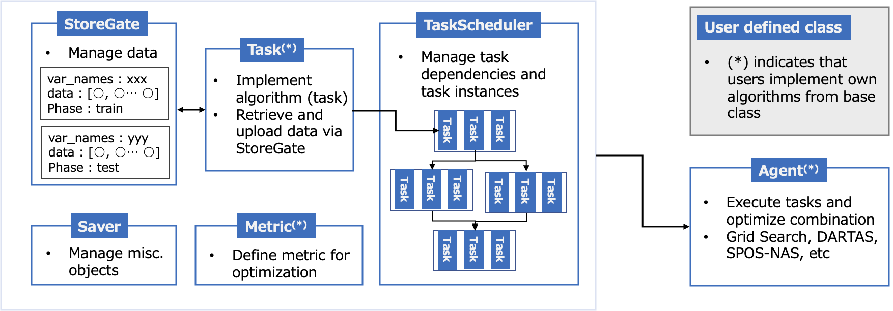

[](https://github.com/UTokyo-ICEPP/multiml/actions/workflows/multiml.yaml)

# multiml
multiml is a prototype framework for developing multi-step machine learnings. The framework provides a method to connect multiple machine learnings with features of:
  * optimizing combination of machine learning models and hyperparameters,
  * extensibility that users can implement new algorithms.

**Any new idea, issues and Pull requests are welcome!**

## Installation
Requiremnets:
  * CentOS 7.6+
  * Python 3.6+
 
### minimum setup
```bash
$ pip install -e .
```

### with machine learning libraries
```bash
$ pip install -e .[pytorch,tensorflow]
```

## Quick start and API references
Please see [multiml documentation](https://utokyo-icepp.github.io/multiml-doc/index.html).

## Tests and coding style
Please test and apply yapf before you commit changes.
```bash
$ python setup.py test
```
```bash
$ yapf -i [changed file]
```

## Overview of multiai framework


## Examples
See the example directory. The following example is to run two-step machine learnings using iris dataset.

```bash
$ python run_iris_classification.py
```

## Application
  * [Event Classification with Multi-step Machine Learning](https://www.epj-conferences.org/articles/epjconf/abs/2021/05/epjconf_chep2021_03036/epjconf_chep2021_03036.html)([arxiv](https://arxiv.org/abs/2106.02301))
